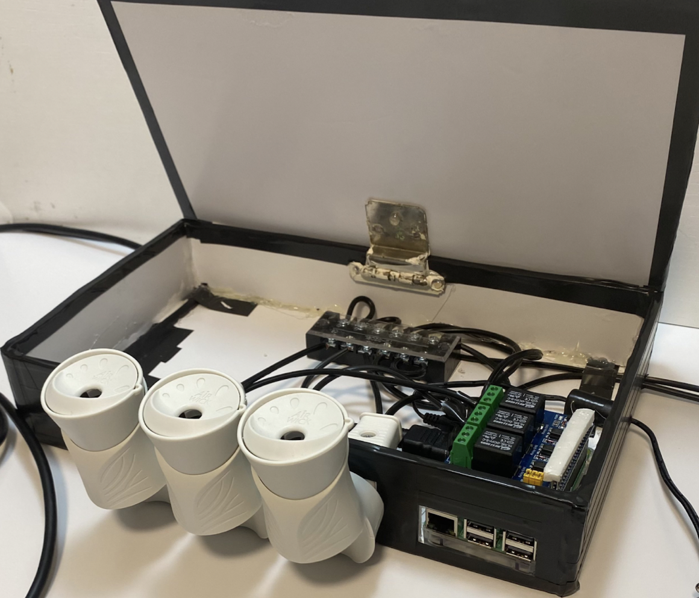
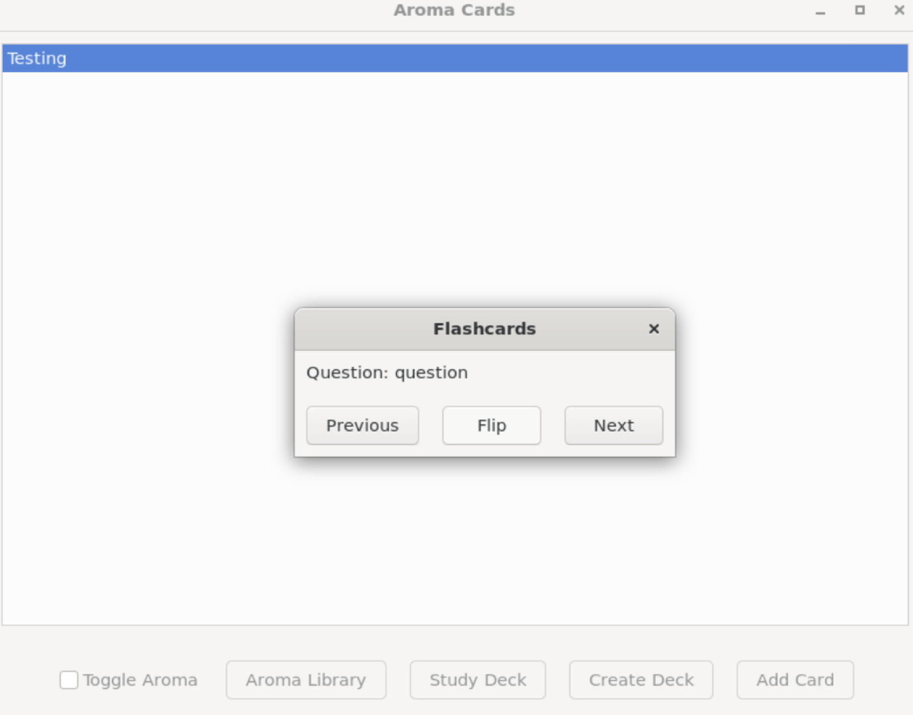

# Aroma-Study-System
A flashcard-based study system leveraging aromas to enhance memory retention

This project allows a user to create flashcards for studying topics of their choice. The intent is to introduce a specialized aroma system alongside analytics that will boost the effectiveness of study sessions.

## Getting Started

These instructions will get you a copy of the project up and running on your local machine for development and testing purposes.

### Prerequisites
- C++ compiler (e.g., g++)
- cmake
- wxWidgets-3.2.4 

### Installing
Clone the project repository

### Building
1) Navigate to the root directory of the project
2) Run the following command: make

### Run
1) Navigate to the root directory of the project
2) Run the following command: ./bin/program

### Project Structure
/src: .cpp source files
/include: .h header files
makefile: In the main directory
/bin: Executable file after build

